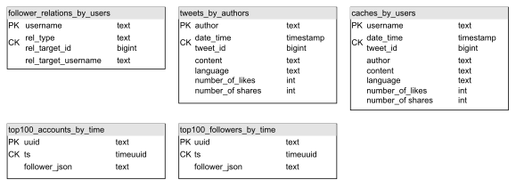
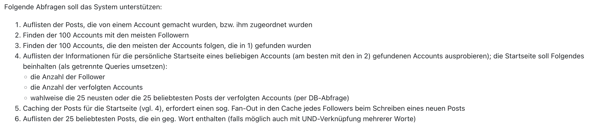

# BDEA - Abgabe 3 - Doku
Die folgende Doku ist ebenfalls in diesen Dateien zu finden:
- Datenmodellierung: **data-model.pdf**
- Begründung Cassandra & Setup Cassandra: **setup.pdf**
- Queries: **queries.pdf**
- Lessons Learned: **lessons-learned.pdf**

### Aufgabenstellung: Wir zwitschern uns einen!
Lassen Sie uns unser eigenes **Social Network** aufbauen. Damit es realistisch wird, stelle ich Ihnen unten einige (aus Twitter extrahierte Follower-Beziehungen zur Verfügung (der Original-Link existiert leider nicht mehr)) sowie einige Posts von Prominenten, die Sie bspw. zufällig auf die 100 User IDs mit den meisten Followern verteilen (vgl. Abfragen). Ferner soll das System das Speichern von Likes für Posts unterstützen (also von welchem User wurde ein Post eines anderen Users gelikt), diese generieren Sie bitte zufällig an passender Stelle.

Folgende Abfragen soll das System unterstützen:

1. Auflisten der Posts, die von einem Account gemacht wurden, bzw. ihm zugeordnet wurden
2. Finden der 100 Accounts mit den meisten Followern
3. Finden der 100 Accounts, die den meisten der Accounts folgen, die in 1) gefunden wurden
4. Auflisten der Informationen für die persönliche Startseite eines beliebigen Accounts (am besten mit den in 2) gefundenen Accounts ausprobieren); die Startseite soll Folgendes beinhalten (als getrennte Queries umsetzen):
   - die Anzahl der Follower
   - die Anzahl der verfolgten Accounts
   - wahlweise die 25 neusten oder die 25 beliebtesten Posts der verfolgten Accounts (per DB-Abfrage)
5. Caching der Posts für die Startseite (vgl. 4), erfordert einen sog. Fan-Out in den Cache jedes Followers beim Schreiben eines neuen Posts 
6. Auflisten der 25 beliebtesten Posts, die ein geg. Wort enthalten (falls möglich auch mit UND-Verknüpfung mehrerer Worte)

## Datenmodellierung
Zunächst ist es wichtig zu erwähnen, dass in C* die Datenmodellierung nicht die klassischen Konzepte der Datenmodellierung
relationaler Datenbanken verfolgt werden. Statt sich anhand eines ER-Diagramms die benötigten Entitäten und deren
Beziehungen zu überlegen, verfolgt man hier den Ansatz, als erstes die Queries zu entwerfen. Dies hat unter anderem den Hintergrund, dass in C* gewisse Operationen,
welche in diversen relationalen Datenbanken als selbstversändlich angesehen werden, schlichtweg nicht unterstützt werden.
Schwierige Operationen sind bspw. **GROUP BY** und **ORDER BY**, welche nur unter erheblichen Einschränkungen, im Vergleich
zu relationalen Datenbanken, verwendet werden können.

Dies hat letztendlich zur Folge, dass für so gut wie jede Abfrage eine eigene Tabelle entworfen wird, welche die Daten in einem optimalen Schema bereitstellt.

Auf Basis dieser Überlegungen, hat sich das Team letztendlich für das in der folgenden Abbildung dargestellte Datenmodell entschieden:



Im Wesentlichen werden die Daten in den Tabellen **follower_relations_by_users** und **tweets_by_authors** gespeichert.

**follower_relations_by_users**:
- Den Partition-Key stellt hier der **username** dar, welcher an die Bedingung geknüpft ist, unique zu sein
- Der Clustering-Key **rel_type** gliedert die gespeicherten Follower Relationen in **"follower"** und **"follows"** Relationen
- Da in C* jede Kombination aus Partikion-Key und Clustering-Key unique sein muss, damit ein **INSERT** nicht zu einem **UPDATE** wird, wurde für den Clustering-Key ebenfalls die Id des Ziels der Relation als Attribut mit aufgenommen (**rel_target_id**)
- Darüber hinaus wird für jede gespeicherte Relation der **rel_target_username** mit gespeichert, welche anhand eines Skripts (**/cleaning_scripts/follower_relations.py**) generiert wurden

**tweets_by_authors**
- Den Partition-Key stellt hier der Name des Authors (**author**) dar, für welchen nun eine beliebige Menge an Tweets gespeichert werden kann (begrenzt lediglich von den systembedingten Limitierungen von C*)
- Als Clustering-Keys werden hier die **date_time** zu der der Tweet abgesetzt wurde, sowie eine eindeutige **tweet_id** gespeichert
- darüber hinaus beinhaltet jeder Datensatz weitere Informationen über den jeweiligen Tweet, wie bspw. den Inhalt (**content**)

Die Tabelle **caches_by_users** dient der Speicherung der nutzerspezifischen Caches für die Startseite der Anwendung. Ein Cache für einen Nutzer kann hierbei 
über das Skript **/runtime_scripts/init_cache_for_user.py** initialisiert werden. Hierbei werden für den jeweiligen **username** (Partition-Key)
die Tweets der verfolgten Accounts aus der Tabelle **tweets_by_authors** extrahiert und in chronologische Reihenfolge in dessen Cache gespeichert. Eine Abfrage auf dieser Tabelle ist um einiges schneller,
als die erneute Extraktion der relevanten Tweets, bei jedem Abruf der Startseite. Beim Einfügen eines neuen Tweets in **tweets_by_authors** anhand des Skripts **/runtime_scripts/insert_new_tweets.py**
wird dieser zudem ebenfalls in den Cache eines jeden Nutzers eingefügt, welcher als Follower des Authors in der Tabelle **follower_relations_by_users** gespeichert ist.

Die Tabellen **top100_accounts_by_time** und **top100_followers_by_time** dienen als Time-Series-Tables für die Umsetzung der Queries 2 und 3. 

## Begründung Cassandra
Cassandra erschien dem Team aufgrund der Vorlesungsinhalte als eine sichere Wahl.
Im Nachgang kann festgestellt werden, dass Cassandra trotz aller Vorteile für ein Twitter-Szenario unangemessen ist.
Viele mögliche (und auch zum Teil in der Augabenstellung geforderten) Queries sind schlichtweg ohne massives Aufblähen der Datenmenge nicht darstellbar.
Im Anbetracht alternativer Technologien und deren Möglichkeiten, Interaktionen in einem sozialen Netzwerk zu speichern und zu prozessieren, ist die Wahl von
Cassandra für diese Aufgabenstellung kaum rechtfertigbar.

## Setup Cassandra

Da sich das Team für Cassandra mit einem (Lucene-Plugin)[https://github.com/Stratio/cassandra-lucene-index] entschieden hat konnte das offizielle Cassandra-Image nicht verwendet werden.
Hier wurde, nach vielen zeitaufwändigen Iterationen dann schlussendlich von einem "FROM SCRATCH" gebautem Image abgesehen und als Grundlage
auf (jeffharwell/cassandra-lucene)[https://github.com/jeffharwell/cassandra-lucene] zurückgegriffen.

Auf Basis dieses Images wurde das Team-Eigene ```Dockerfile``` sowie die Team-Eigene ```docker-compose.yml``` geschrieben.
Da es in immer wieder zu Abstürzen aufgrund einer korrupten SSTable im Base-Image kam wurde ein Healthcheck angepasst um diese Datei zu löschen.

Ebenfalls kam es, bei unterdimensionierung der Speicherressourcen zu äußerst instabilen Containern. Daher wurde die verfügbare Speichermenge auf 4GB gesetzt.

### Setup des Cassandra-Clusters
Im Ordner ```docker-stratio``` genügt es den Befehl ```docker-compose up``` zu verwenden um den Cluster zu starten.
Da es sich hierbei um einen lokalen Testcluster handelt sind die Authentisierungsoptionen abgeschaltet.
Nach der anfänglichen Start-Phase des Clusters kann mithilfe von ```docker ps```gepfüft werden, ob auch alle Nodes vorhanden sind (cass1, cass2, cass3).  
Mit ```docker exec -it cass1 cqlsh``` sowie darauf folgend ```describe keyspaces``` kann überprüft werden, ob CQL korrekt funktioniert. 

Mithilfe von ```docker exec -it cass1 nodetool status``` lässt sich der Cluster sowie sein Status beschreiben.

### CSVs in Container kopieren
Da die generierten CSV Dateien (Generierung anhand der Skripts **/cleaning_scripts/tweets.py** und **/cleaning_scripts/follower_relations.py**) leider zum Teil die maximale git-Größe übersteigen müssen diese manuell vom jeweiligen Speicherort importiert werden.

```bash
cd Documents/UNI/BDEA/CA_3/BDEA3/
docker cp res_follower.csv cass1:/data/res_follower.csv
docker cp tweets_clean.csv cass1:/data/tweets_clean.csv
```

### Aufsetzen der Tabellen
```bash
docker exec -it cass1 cqlsh
CREATE KEYSPACE twitter WITH REPLICATION = {'class': 'SimpleStrategy', 'replication_factor': 3};
USE twitter;
CREATE TABLE twitter.tweets_by_authors (author TEXT, date_time TIMESTAMP, tweet_id BIGINT, content TEXT, language TEXT, number_of_likes INT, number_of_shares INT, PRIMARY KEY ((author), date_time, tweet_id)) WITH CLUSTERING ORDER BY (date_time DESC);
CREATE TABLE twitter.caches_by_users (username TEXT, date_time TIMESTAMP, tweet_id BIGINT, author TEXT, content TEXT, language TEXT, number_of_likes INT, number_of_shares INT, PRIMARY KEY ((username), date_time, tweet_id)) WITH CLUSTERING ORDER BY (date_time DESC);
CREATE TABLE twitter.follower_relations_by_users (username text, rel_type text, rel_target_id BIGINT, rel_target_username text,  PRIMARY KEY ((username), rel_type, rel_target_id));
```
### Tweets Index für Lucene anlegen
```bash
CREATE CUSTOM INDEX tweets_index ON twitter.tweets_by_authors () USING 'com.stratio.cassandra.lucene.Index' WITH OPTIONS = {'refresh_seconds': 1, 'schema': '{fields: {author: {type: "text", analyzer: "english"}, date_time: {type: "date", pattern: "yyyy-MM-dd HH:MM:SS"}, tweet_id: {type: "integer"}, content: {type: "string"}, language: {type: "string"}, number_of_likes: {type: "integer"}, number_of_shares: {type: "integer"}}}'};
```
### Follower Relations importieren
```bash
COPY twitter.follower_relations_by_users (username, rel_type, rel_target_username, rel_target_id) FROM 'data/res_follower.csv' WITH HEADER = TRUE;
```
Testen, ob die Daten erfolgreich importiert wurden
```bash
SELECT COUNT(*) FROM twitter.follower_relations_by_users WHERE username = 'katyperry';
```
### Tweets importieren
```bash
COPY twitter.tweets_by_authors (author, content, date_time, tweet_id, language, number_of_likes, number_of_shares) FROM 'data/tweets_clean.csv' WITH HEADER = TRUE;
```
Testen, ob die Daten erfolgreich importiert wurden:
```bash
SELECT COUNT(*) FROM twitter.tweets_by_authors;
```
## Queries

1. ```SELECT \* FROM twitter.tweets_by_authors WHERE author = 'katyperry';```</br></br>
2. -> Extraktion der Top 100 per Skript und Schreiben in Time-Series-Table</br>
-> Abfrage dann auf dieser Table</br>
```SELECT follower_json FROM twitter.top100_accounts_by_time LIMIT 1;```</br></br>
3. -> Extraktion der Top 100 "Mainstream-Follower" per Skript und Schreiben in Time-Series-Table</br>
-> Abfrage dann auf dieser Table</br>
```SELECT follower_json FROM twitter.top100_followers_by_time LIMIT 1;```</br>

**Das Skript für Query 2 und Query 3 (/runtime_scripts/periodic_script.py) ist als periodisch laufender Batch-Job (z.B unter Verwendung eines Jenkins-Automatisierungsservers) gedacht.**</br></br>

4. 
    1. ```SELECT username, COUNT(\*) AS followers FROM twitter.follower_relations_by_users WHERE username = 'katyperry' AND rel_type = 'follower';```</br></br>
    2. ```SELECT username, COUNT(\*) AS follows FROM twitter.follower_relations_by_users WHERE username = 'katyperry' AND rel_type = 'follows';```</br></br>
    3. Mit Python Skript (**/runtime_scripts/init_cache_for_user.py**) den Cache für einen beliebigen User initialisieren. Danach mit folgender Abfrage die 25 neusten Post der verfolgten Accounts des jeweiligen Users aus dem Cache abrufen:</br>
   ```SELECT * FROM twitter.caches_by_users WHERE username = <username> LIMIT 25;```</br></br>
5. In C* leider nicht mit Queries alleine umsetzbar. Lösung daher mit Python Skript (**/runtime_scripts/insert_new_tweet.py**).</br>
- Neuen Tweet in twitter.tweets_by_authors schreiben
- Follower des Autors aus twitter.follower_relations_by_user extrahieren
- Neuen Tweet jeweils in den Cache jedes Followers in twitter.caches_by_users schreiben</br></br>
6. Eigentlich bietet Lucene hier die Filter-Types **phrase** und **contains** an, um nach den Vorkommnissen gewisser Keywords zu suchen. Leider gab es hierbei insoweit Probleme, dass unter Verwendung besagter Filter-Types ein **Equals** statt **Contains** abgebildet wurde. Da wir die Ursache des Problems nicht identifizieren konnten, haben wir hier stattdesssen die Filter-Types **wildcard** und **regexp** verwendet, um die gewünschte Funktionalität abzubilden.</br></br>
   Für einen Begriff:</br>
   ```SELECT * FROM twitter.tweets_by_authors WHERE expr(tweets_index, '{filter: {type: "wildcard", field: "content", value: "\*hello\*"}, sort: {field: "number_of_likes", reverse: true}}') LIMIT 25;```</br></br>
   Für zwei - x Begriffe:</br>
   ```SELECT * FROM twitter.tweets_by_authors WHERE expr(tweets_index, '{filter: {type: "regexp", field: "content", value: "(.\*\n\*from.\*\n\*hello.\*\n\*)|(.\*\n\*hello.\*\n\*from.\*\n\*)"}, sort: {field: "number_of_likes", reverse: true}}') LIMIT 25;```

## Lessons Learned

#### Kenne deine Datenbanken
Der naive Ansatz, sich auf eine Datenbank zu stürzen weil man neugierig ist und in der Vorlesung erlerntes Wissen gerne einmal hands-on anwenden möchte ist,
wenn auch sicherlich von gutem Willen strotzend, kein methodisch sauberes Vorgehen.
Bei der Auswahl der Technologie würden sich die Teammitglieder in Zukunft auf folgendes Vorgehen verlassen:
- Anforderungen evaluieren
- Mit einem kleinen Datenset und (wenn auch evtl funktionseingeschränkten) offiziellen Docker-Images ein Proof-Of-Concept (POC) erarbeiten
- Auf Basis der Learnings des POC die Datenmodellierung beenden
- Die Container auf die spezifischen Anforderungen anpassen und somit den ersten Demo-Stand erreichen

#### BigData Datenbanken brauchen Platz
Cassandra ist, wie andere Datenbanken im BigData Bereich recht ressourcen-hungrig.
Die Allocation von 4GB ermöglicht es, einen Cassandra Cluster (ohne weitere, zeitintensive und experimentelle Anpassungen an der cassandra.yaml) stabile Container 
im Betrieb zu haben, welche von einem modernen Home-PC oder Laptop noch zu handhaben sind.
Für einen Produktivbetrieb empfiehlt sich als Untergrenze 8GB.

#### Fremde Images - Fremde Bedürfnisse
Bei der verwendung von fremden Images, welche zudem noch unzureichend Überprüft wurden ist (wie bei jedem fremden Code) mit schlechten Überraschungen zu rechnen.
Im Falle dieser Abgabe wurde das Team mit folgenden Problemen konfrontiert:
- jeffharwell/cassandra-lucene
  - Jeff Harwell scheint ein Entwickler mit starken Überzeugungen zu sein. Leider treiben diese Überzeugungen den Entwickler zum verfassen eines Scripts,
  das dynamisch die cassandra.yaml überschreibt. Dieses Vorgehen ist sowohl unsauber (nicht dokumentiert) als auch unfassbar frustrierend für das Teammitglied, 
  welches mit dem mysteriösen "nicht übernehmen" der Settings beschäftigt ist.
  - Duplizierte cassandra.yaml (/opt/jmx-exporter/etc/cassandra.yml und /etc/cassandra/cassandra.yaml) führen auf alle fälle zu verwirrung - vor allem wenn man zuerst die falsche YAML-Datei aufspürt.
- From Scratch
  - Das von Grundauf installieren von Cassandra auf einem Dockercontainer ist recht mühsam - vor allem wenn die meisten Guides auf veraltete und inzwischen archivierte Inhalte zeigen.
  - Das Aufspüren der jar-files eines vor 4 Jahre eingestellten Plugins kann Kopfschmerzen bereiten. Unter Umständen hätte das Team bei Aufmerksamer betrachtung des Repositories früher bemerken können, dass das Projekt inzwischen eingestellt ist und hätte sich dann nach anderen Technologien umgesehen.
  - Selbst nach erfolgreicher installation von Cassandra und dem Lucene-Plugin sowie der erzeugung eines stabilen Docker-Containers kann es bei der Bildung eines Clusters anscheinend wieder kritisch werden - an diesem Punkt hat das Team sich für das neue Base-Image entschieden (Zeitmangel, Frust)

#### Reine Schreibgeschwindigkeit rechtfertigt nicht alles
Im Anbetracht der Zeitaufwände die Erbracht werden mussten, um ein starres, sehr eingeschränktes Query-Schema auf den gegebenen Use-Case anzuwenden sowie der Teils stark suboptimalen Lösungen die daraus resultierten ist abzuwägen, ob nicht in vielen Fällen eine flexiblere Datenbank in ihren Vorteilen überwiegt.
Gerade im Bereich Datenanalyse sowie nested Queries ist Cassandra in reinform extrem eingeschränkt.
